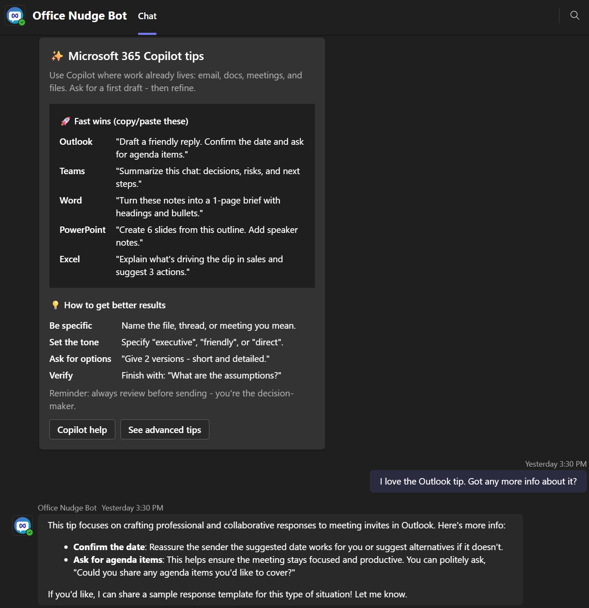

# Copilot Adoption Bot

**Accelerate Microsoft 365 Copilot adoption with targeted, contextual guidance delivered directly in Microsoft Teams.**



A Teams bot that sends beautifully designed adaptive cards with Copilot tips, prompt examples, and best practices to help your users get the most out of Microsoft 365 Copilot. Perfect for IT teams and adoption specialists looking to drive real behavior change and maximize Copilot ROI.

---

## Why This Bot?

Email training campaigns get ignored and classroom training fades fast. **Copilot Adoption Bot solves the *last-mile* of Copilot rollout** by delivering bite-sized, contextual prompts and tips inside Microsoft Teams the place users already are with delivery tracking, targeting, and scheduling that traditional comms can't offer. The goal is to convert Copilot *licenses* into measurable Copilot *usage* and ROI.

| Traditional Email | Copilot Adoption Bot |
|------------------|------------------|
| Often ignored or filtered | Appears directly in Teams chat |
| Static content | Interactive adaptive cards |
| No engagement tracking | Full delivery and interaction logging |
| One-size-fits-all | Targeted to specific users or groups |
| Manual sending | Scheduled and automated delivery |

**Who it's for:** IT departments, change managers, and M365 adoption specialists rolling out Copilot to their organisation.

---

## How It Works

At a glance, the solution is composed of:

- **Teams bot + admin API** A single ASP.NET Core app (`Web.Server`, .NET 10) hosts both the Bot Framework messaging endpoint (`/api/messages`) and the management API consumed by the React UI.
- **Admin UI** A React + Vite + Fluent UI app (`web.client`) where IT/adoption teams author Adaptive Card templates, pick recipients, schedule sends, and review delivery logs.
- **Core engine** `Common.Engine` holds the business logic: template management, batch orchestration, message sending, Microsoft Graph sync, smart groups, and Copilot usage statistics.
- **Storage** Azure **Table + Blob + Queue Storage only** no SQL database. Tables hold templates, batches, logs, the user cache and smart groups; a `batch-messages` queue drives a background worker (`BatchMessageProcessorService`) that fans out proactive sends with bounded parallelism.
- **Microsoft Graph integration** Syncs users via delta queries, optionally pulls per-user Copilot usage reports, installs the Teams app for target users, and sends proactive 1:1 messages on their behalf.
- **Smart Groups (optional)** AI Foundry-powered dynamic targeting (e.g. "users who haven't tried Copilot in Excel this month") so campaigns reach exactly the right audience.

---

## Key Use Cases

### Copilot Adoption (Primary Focus)
- **Copilot Chat Tips** - Ready-to-use prompts and best practices
- **App-Specific Guidance** - Tips for Copilot in Outlook, Word, Excel, PowerPoint, Teams
- **Prompt Engineering** - Help users craft better prompts
- **Feature Discovery** - Introduce new Copilot capabilities
- **Adoption Campaigns** - Progressive tip delivery over time

### Additional Scenarios
- **Employee Onboarding** - Welcome messages and getting-started resources
- **Training Reinforcement** - Follow-up nudges after training sessions
- **Feature Announcements** - New Microsoft 365 features
- **Feedback Collection** - Gather user feedback through interactive cards

---

## Key Features

- **Template Management** - Create and edit adaptive card templates
- **Azure Storage Only** - No SQL database required (Table + Blob Storage)
- **Teams Bot Integration** - Direct delivery via Teams bot conversations
- **Message Logging** - Track delivery status and recipients
- **User Cache with Delta Queries** - Efficient user data syncing from Microsoft Graph
- **Copilot Usage Statistics** - Optional per-user Microsoft 365 Copilot activity tracking
- **Smart Groups** - AI-powered dynamic user targeting (requires AI Foundry)
- **Authentication** - Teams SSO and MSAL support
- **Modern UI** - React-based interface with Fluent UI components

---

## Technology Stack

**Backend**
- .NET 10 | ASP.NET Core | Microsoft Bot Framework
- Azure Table Storage | Azure Blob Storage
- Microsoft Graph API

**Frontend**
- React 18 | TypeScript | Fluent UI
- Vite | Azure MSAL | Teams JS SDK

---

## Documentation

| Document | Description |
|----------|-------------|
| **[Setup Guide](docs/SETUP.md)** | Teams bot setup and Graph permissions |
| **[Development Guide](docs/DEVELOPMENT.md)** | Local development environment and tunneling |
| **[Configuration Reference](docs/CONFIGURATION.md)** | Complete configuration options reference |
| **[User Guide](docs/USER-GUIDE.md)** | Illustrated walkthrough of the admin UI and Teams experience |
| **[Usage Guide](docs/USAGE.md)** | How to create templates and send messages |
| **[Features Guide](docs/FEATURES.md)** | Detailed feature documentation |
| **[Deployment Guide](docs/DEPLOYMENT.md)** | Azure deployment and CI/CD pipelines |
| **[Deploy with Copilot CLI](docs/DEPLOYMENT-COPILOT-CLI.md)** | Agent-guided Azure deployment from your terminal |
| **[Scaling Guide](docs/SCALING.md)** | Capacity model at scale and the performance escalation ladder |
| **[Security Guide](docs/SECURITY.md)** | Security best practices |
| **[Troubleshooting](docs/TROUBLESHOOTING.md)** | Common issues and solutions |

---

## Quick Start

### 1. Prerequisites
- [.NET 10 SDK](https://dotnet.microsoft.com/download/dotnet/10.0)
- [Node.js 20 LTS](https://nodejs.org/)
- [Azure Subscription](https://azure.microsoft.com/free/)
- [Microsoft 365 tenant](https://developer.microsoft.com/microsoft-365/dev-program) with Teams

### 2. Clone & Install

```bash
git clone https://github.com/pnp/copilot-adoption-bot.git
cd copilot-adoption-bot/src/Full/Bot

# Backend
dotnet restore
dotnet build

# Frontend
cd Web/web.client
npm install
npm run build
```

### 3. Configure

See the **[Setup Guide](docs/SETUP.md)** for detailed configuration steps:
- Create Teams bot in Developer Portal
- Configure Microsoft Graph permissions
- Set up user secrets for local development
- Configure Azure resources

### 4. Run Locally

```bash
# Backend
cd Web/Web.Server
dotnet run

# Frontend (in another terminal)
cd Web/web.client
npm run dev
```

Visit `https://localhost:5173` for the web interface during development (the Vite dev server, which proxies API calls to the backend). The backend API itself listens on `https://localhost:7053` and `http://localhost:5295` (set in `Web.Server/Properties/launchSettings.json`; watch the `dotnet run` output for the actual values).

---

## Deployment

Deploy to Azure App Service using:

**Manual Deployment:**
```bash
cd src/Full/Bot
dotnet publish Web/Web.Server/Web.Server.csproj -c Release -o ./publish
az webapp deploy --resource-group myResourceGroup --name myAppName --src-path ./publish
```

**Automated CI/CD:**
- GitHub Actions (`.github/workflows/azure-deploy.yml`)
- Azure DevOps (`.azure-pipelines/azure-deploy.yml`)

See the **[Deployment Guide](docs/DEPLOYMENT.md)** for complete instructions.

---

## Project Structure

```
src/Full/Bot/
├── Web.Server/          # ASP.NET Core Web API and Teams bot
├── web.client/          # React frontend application
├── Common.Engine/       # Core business logic and services
├── Common.DataUtils/    # Data access and storage utilities
└── UnitTests/          # Unit and integration tests
```

---

## Security

**Key security practices:**
- Use Azure Key Vault for secrets in production
- Use `dotnet user-secrets` for local development
- Enable HTTPS only
- Implement proper RBAC for Azure resources
- Validate all adaptive card JSON before storage
- Regularly rotate secrets and keys

See the **[Security Guide](docs/SECURITY.md)** for comprehensive security best practices.

---

## License

This project is provided as-is under the MIT License. See [LICENSE](LICENSE) for details.

---

## Contributing

Contributions are welcome! Please:
1. Fork the repository
2. Create a feature branch
3. Make your changes
4. Submit a pull request

---

## Support

- **Issues**: Report bugs or request features via [GitHub Issues](https://github.com/pnp/copilot-adoption-bot/issues)
- **Documentation**: Check our comprehensive [documentation](#documentation)
- **Troubleshooting**: See the [Troubleshooting Guide](docs/TROUBLESHOOTING.md)

---

## Community

This project is part of the [Microsoft 365 & Power Platform Community](https://pnp.github.io/).

- **Twitter**: [@m365pnp](https://twitter.com/m365pnp)
- **YouTube**: [Microsoft 365 Community](https://aka.ms/m365pnp/videos)
- **Blog**: [Microsoft 365 Community Blog](https://pnp.github.io/blog/)

---

Made with ❤️ by the Microsoft 365 Community
