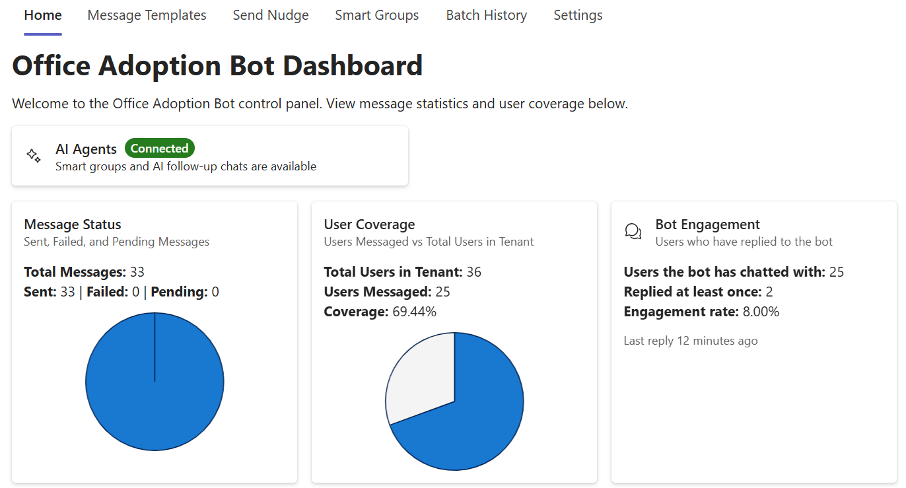
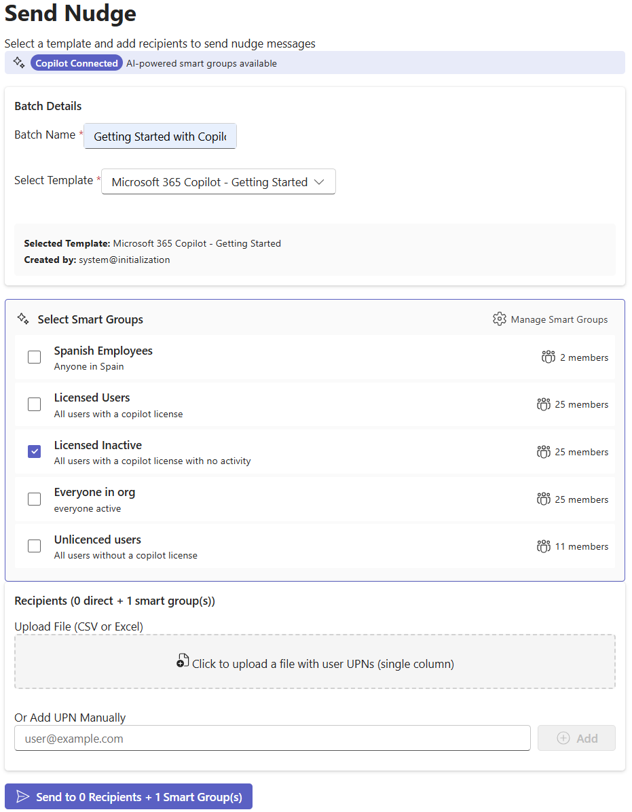
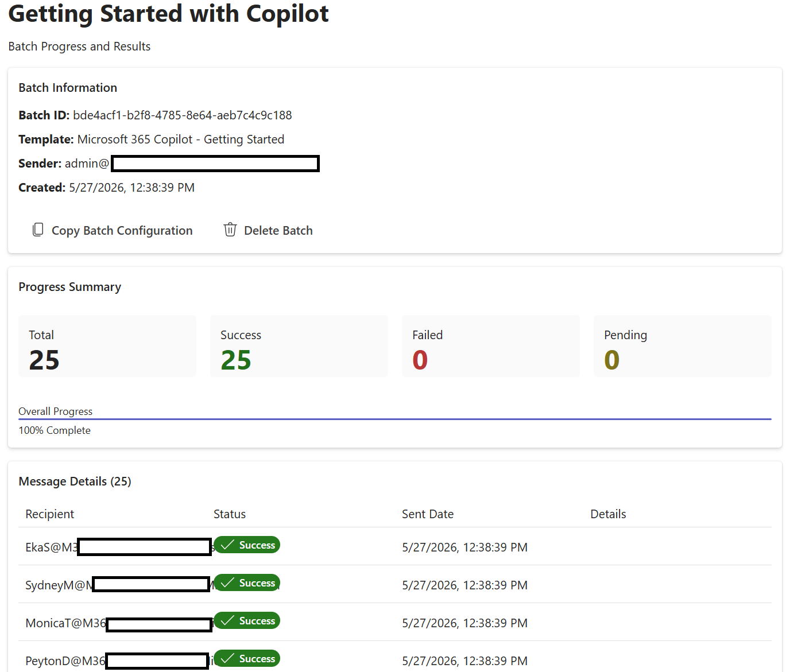
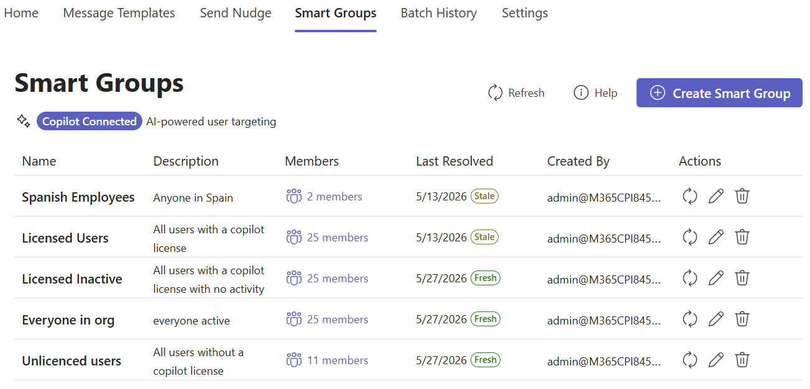
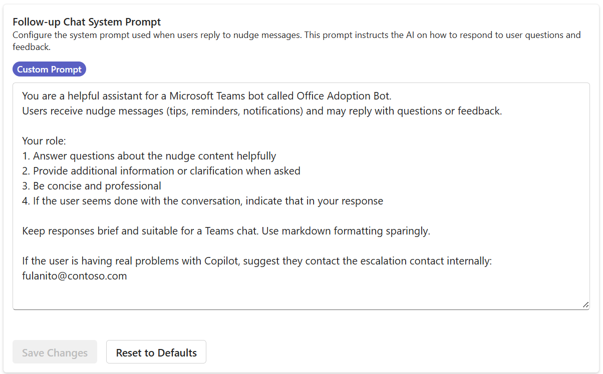

# User Guide

This guide walks an **adoption admin** through the Copilot Adoption Bot end-to-end:
what your end users see in Teams, and how you drive it from the web admin app.

It is task-oriented and screenshot-led. For deeper conceptual or reference material
see [FEATURES.md](FEATURES.md), [USAGE.md](USAGE.md) and [CONFIGURATION.md](CONFIGURATION.md).

## Table of contents

1. [What end users see in Teams](#1-what-end-users-see-in-teams)
2. [The admin dashboard](#2-the-admin-dashboard)
3. [Sending a nudge](#3-sending-a-nudge)
4. [Tracking delivery](#4-tracking-delivery)
5. [Targeting with Smart Groups](#5-targeting-with-smart-groups)
6. [Configuring the AI follow-up assistant](#6-configuring-the-ai-follow-up-assistant)
7. [Suggested rollout](#7-suggested-rollout)

---

## 1. What end users see in Teams

When you send a nudge, the recipient gets a 1:1 chat from **Office Nudge Bot**
(the default display name; this is configurable) containing an Adaptive Card with
your tips. If AI follow-up chats are enabled, they can simply *reply* in the chat
and the bot will answer questions about the tip.

Highlights:

- **Rich Adaptive Card** title, tables of "fast-win" prompts per app
  (Outlook, Teams, Word, PowerPoint, Excel), best-practice guidance, and action
  buttons such as *Copilot help* / *See advanced tips*.
- **Conversational follow-up** the user can reply ("*I love the Outlook tip,
  got any more info about it?*") and the bot, backed by your configured AI agent,
  responds in natural language while staying on-message.
- **Non-disruptive** delivered as a normal Teams chat rather than an email,
  so it shows up where work already happens.

> Tip: the bot must be installed for the recipient before it can message them.
> The Adoption Bot uses Microsoft Graph to install itself for target users
> automatically  see [SETUP.md](SETUP.md) for the required permissions.

---

## 2. The admin dashboard

Sign in to the web app  the **Home** tab gives you the overall health and
reach of your adoption programme at a glance.

What each panel means:

- **AI Agents**  *Connected* means Smart Groups and AI follow-up chats are
  available (an AI Foundry agent is wired up). If this shows disconnected, you
  can still send nudges, you just lose the AI-powered features.
- **Message Status**  cumulative *Sent / Failed / Pending* counts across every
  batch. Use this to spot mass failures (e.g. an expired secret).
- **User Coverage**  *Users messaged ÷ Total users in tenant*. This is the
  single best "are we actually reaching people?" KPI for an adoption programme.
- **Bot Engagement**  how many of the messaged users have *replied* to the bot
  at least once, with an engagement rate and *last reply* timestamp. Replies
  are a strong signal that the content is resonating.

Across the top you'll find the main navigation: **Home**, **Message Templates**,
**Send Nudge**, **Smart Groups**, **Batch History** and **Settings**.

---

## 3. Sending a nudge

A "nudge" = one Adaptive Card template, sent to one or more recipients, tracked
as a single **batch**. Open the **Send Nudge** tab.

Fill it in top to bottom:

1. **Batch Name**  a friendly label that will appear in Batch History and on
   the status page (here: *Getting Started with Copilot*). Use names that
   describe the campaign, not the date  e.g. *Excel power-users Q1*.
2. **Select Template**  pick one of your Adaptive Card templates from the
   dropdown. The card below the picker confirms *Selected Template* and *Created
   by* so you don't accidentally send the wrong one. Manage templates from the
   **Message Templates** tab (see [USAGE.md](USAGE.md#managing-adaptive-card-templates)).
3. **Select Smart Groups**  tick any AI-powered dynamic groups you want to
   target. Each row shows the group name, description and current member count
   (e.g. *Licensed Inactive  All users with a copilot license with no activity
    25 members*). You can combine multiple groups; the bot de-duplicates
   recipients across them.
4. **Upload File**  alternatively drop a CSV/Excel file with a single column of
   UPNs to message specific people.
5. **Or Add UPN Manually**  type a single UPN and click *Add* for ad-hoc tests.
6. The header *Recipients (0 direct + 1 smart group(s))* always tells you what
   will be sent right now; the action button below restates it
   (*Send to 0 Recipients + 1 Smart Group(s)*) so you can never send blindly.

When you click send, the bot enqueues a job onto its internal background queue
and the UI jumps to the batch status page.

> Best practice: always send the first run of a new template to **yourself** or
> a small pilot group before targeting an org-wide Smart Group.

---

## 4. Tracking delivery

After sending, you land on the per-batch status page (also reachable from
**Batch History**).

This page is your audit trail for one campaign:

- **Batch Information**  Batch ID (use this when raising support tickets),
  template name, sender UPN, and creation timestamp.
- **Copy Batch Configuration** / **Delete Batch**  duplicate the batch to send
  to a different audience, or remove it (this also tidies the related logs).
- **Progress Summary**  *Total / Success / Failed / Pending* counters and an
  overall progress bar. While the background worker is draining the queue
  you'll see Pending tick down and Success tick up; the bar reaches 100% when
  the batch is done.
- **Message Details**  per-recipient list with *Status*, *Sent Date* and
  *Details*. Successful sends show a green *Success* badge; failures show the
  Graph/Bot-framework error so you can act on it (e.g. user has no Teams
  licence, bot not installed, tenant policy block).

For mass exports, see the *Exporting Logs* section in
[USAGE.md](USAGE.md#exporting-logs).

---

## 5. Targeting with Smart Groups

Smart Groups are the bot's killer targeting feature: you describe *who* you
want to reach in natural language, and the AI resolves it against your
Microsoft 365 tenant.

The list view shows every group with:

- **Name**  the label you pick (used in the Send Nudge picker).
- **Description**  the natural-language definition the AI uses to resolve
  members (e.g. *All users with a copilot license with no activity*,
  *Anyone in Spain*).
- **Members**  click to see the current resolved list.
- **Last Resolved**  when the bot last expanded the description into a member
  list. Each row carries a status badge:
  - **Fresh**  recently resolved, safe to use.
  - **Stale**  the resolution is older and may not reflect joiners/leavers or
    new Copilot activity. Click the refresh icon to re-resolve.
- **Created By** and **Actions** (refresh, edit, delete) round out the row.

The *Copilot Connected* pill near the top is your at-a-glance signal that
the AI Foundry agent is reachable. If it disappears, new Smart Groups can't
be created and existing ones won't re-resolve  check the **Settings**
page and the AI Foundry side of the configuration (see
[CONFIGURATION.md](CONFIGURATION.md)).

Click **Create Smart Group** to add a new one  give it a short name and a
prose description like *"People in Finance who haven't used Copilot in Excel
in the last 30 days"*.

> Smart Groups are evaluated when the group is refreshed, not at send time, so
> a freshly-refreshed group gives the most accurate audience. Refresh just
> before a high-value send.

---

## 6. Configuring the AI follow-up assistant

When a user replies to a nudge in Teams, the bot can answer with an LLM-backed
follow-up rather than going silent. The *Follow-up Chat System Prompt* in
**Settings** controls *how* it answers.

The text area is the system prompt sent to the AI agent on every follow-up
reply. The default already covers:

- The bot's identity (*Office Adoption Bot*) and context (users have received
  a nudge).
- The role boundaries answer questions about the nudge content, provide
  clarification, stay concise and professional, and recognise when the
  conversation is naturally over.
- Format guidance keep replies short and Teams-friendly, use markdown
  sparingly.
- An **escalation path** at the bottom: tell users who to contact if they
  have a real Copilot problem (the example shows `fulanito@contoso.com`).

Customise this prompt to:

- Insert your **real escalation contact** (helpdesk alias, internal Yammer
  group, Service Hub URL).
- Set tone of voice (formal vs. casual, English vs. another language).
- Add forbidden topics or guardrails specific to your organisation.

Buttons:

- **Custom Prompt** badge confirms the current prompt is not the shipped
  default.
- **Save Changes**  persist your edits (becomes active immediately for new
  replies; existing in-flight conversations finish on the old prompt).
- **Reset to Defaults**  revert to the shipped prompt if you want to start
  again.

> Treat this prompt like a piece of policy: review it after every product
> change and whenever your support contacts move.

---

## 7. Suggested rollout

A typical adoption programme using this bot looks like:

1. **Wire up the bot** install in Teams, grant Graph permissions, point at
   AI Foundry  see [SETUP.md](SETUP.md).
2. **Create 2-3 starter templates** in **Message Templates** e.g. a generic
   *Getting Started with Copilot* card, an *Outlook prompt pack*, and an
   *Excel power-user* card. Use the [Adaptive Cards Designer](https://adaptivecards.io/designer/)
   to author the JSON.
3. **Define your Smart Groups** at minimum *Licensed Users*, *Licensed
   Inactive*, and *Unlicensed Users*. Refresh them.
4. **Pilot**  send the starter template to yourself + a handful of
   volunteers, watch the batch status page, fix any failures.
5. **Tune the follow-up prompt** in Settings, insert your escalation
   contact, set the tone.
6. **Roll out by segment** target *Licensed Inactive* first; their
   engagement is the easiest adoption win. Use *Bot Engagement* on the
   dashboard to measure reply rate.
7. **Iterate weekly**  one new tip per week, mix Outlook/Word/Excel/Teams
   content, and watch *User Coverage* climb on the dashboard.

---

## See also

- [USAGE.md](USAGE.md)  template management, API reference, log export
- [FEATURES.md](FEATURES.md)  full feature reference including Copilot usage
  statistics
- [CONFIGURATION.md](CONFIGURATION.md)  every configuration key explained
- [TROUBLESHOOTING.md](TROUBLESHOOTING.md)  common failures and fixes
